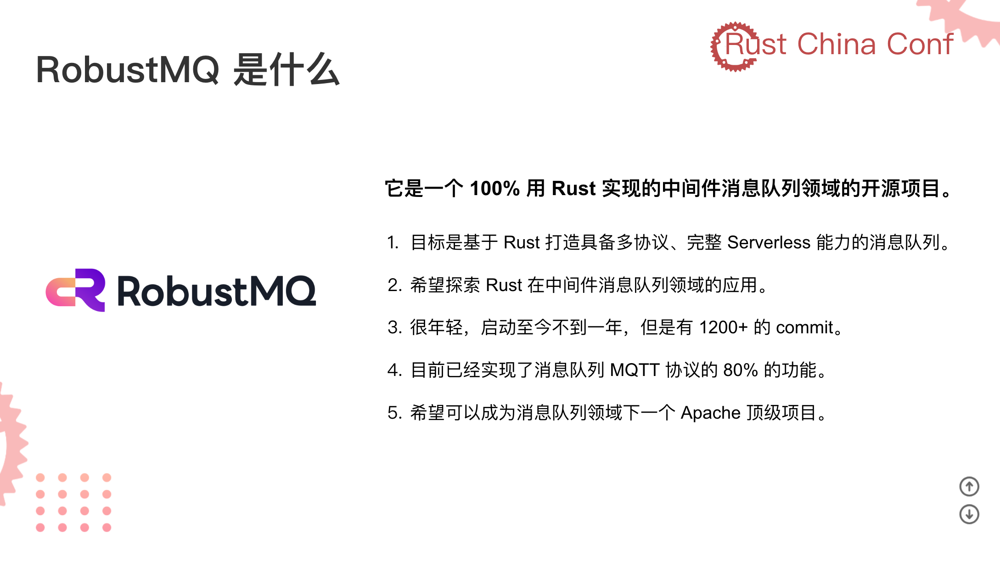

本项目的代码是课程内容配套的可运行的 Demo。完整的项目代码请查看：https://github.com/robustmq/robustmq

RobustMQ 的愿景是构建兼容多种主流消息队列协议、架构上具备完整 Serveless 能力的下一代高性能云原生融合型消息队列.

同时欢迎大家 Star~。

https://docs.qq.com/slide/DSFB6cE5YVFBPSFNQ